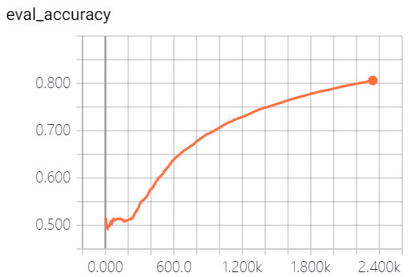

# BERT_USE
主要用了bert-tensorflow和tensorflow_hub

首先要下载bert-tensorflow：
```
pip install bert-tensorflow
```

首先要新建两个文件夹“bert_pretrain_model”和“save_model”
- bert_pretrain_model: BERT模型下载到这里，并进行解压。具体模型下载连接：
[https://github.com/google-research/bert](https://github.com/google-research/bert)
- save_model: python3 model.py 之后模型会保存到这里

## BERT模型文件
BERT模型下载后是一个压缩包，类似于uncased_L-12_H-768_A-12.zip。里面包含了四个文件：
- bert_config.json：BERT模型参数
- bert_model.ckpt.xxxx：这里有两种文件，但导入模型只需要bert_model.ckpt这个前缀就可以了
- vocab.txt：存放词典

## train and eval in tf.estimator
```python
python3 model_estimator.py
```

## output embedding
利用get_embedding.py文件，可以生成token-level embedding和sentence embedding。
- use_sentence: False, output token-level embedding
- use_sentence: True, output sentence embedding

## 自定义打印信息和利用sess跑, train and eval in tf.sess:
```python
python3 train.py
```

## result
eval_accuracy:


